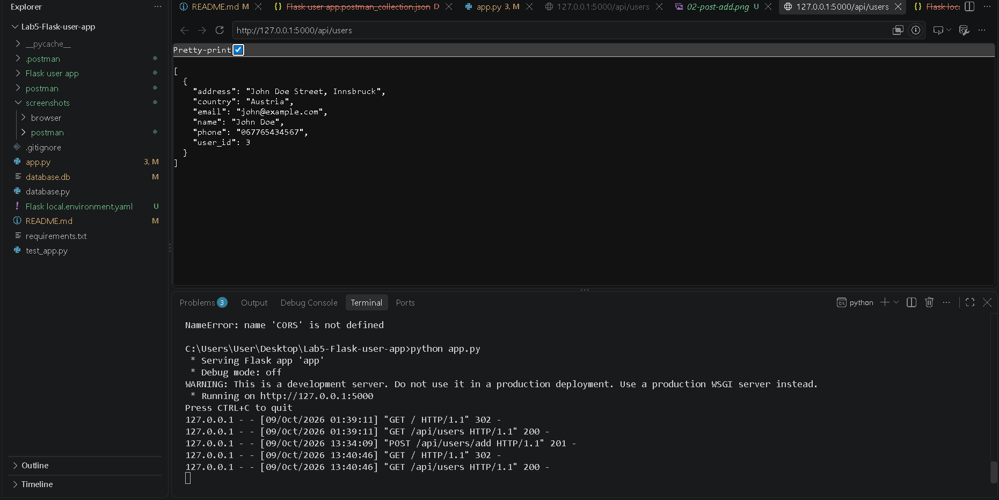
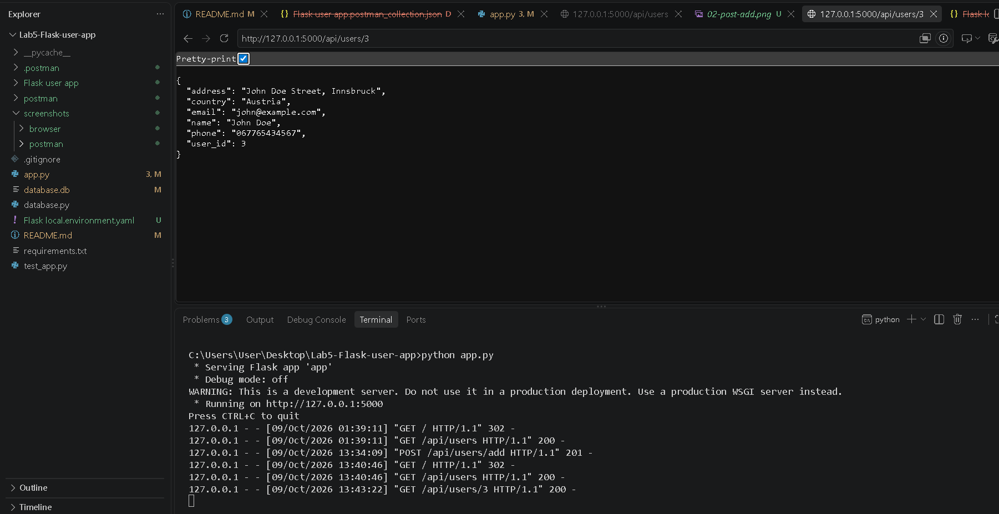
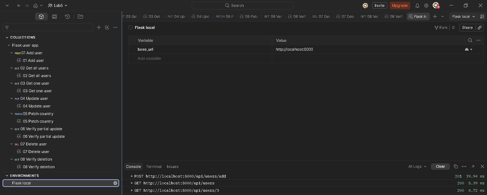
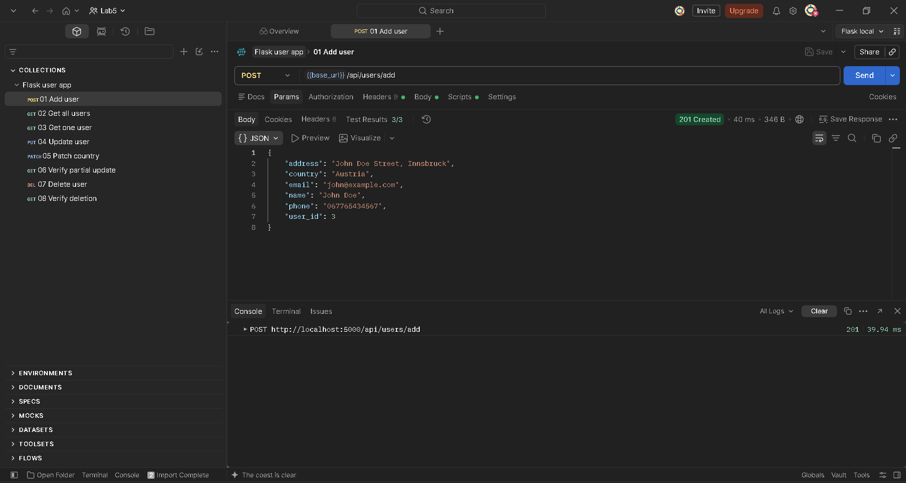
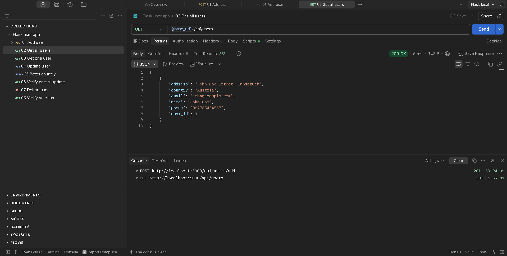
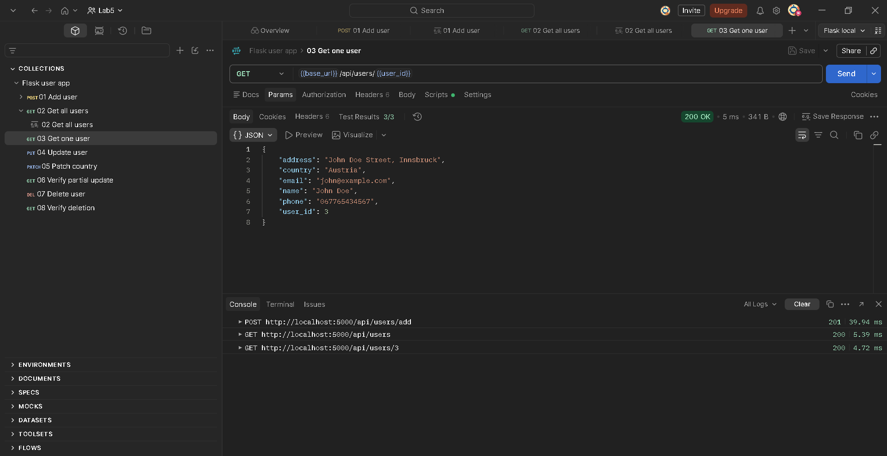
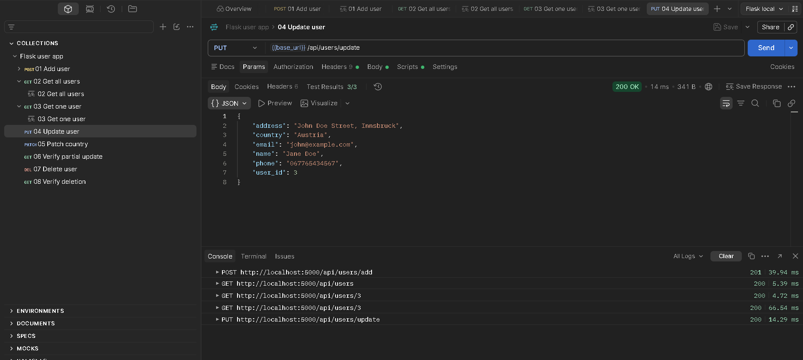
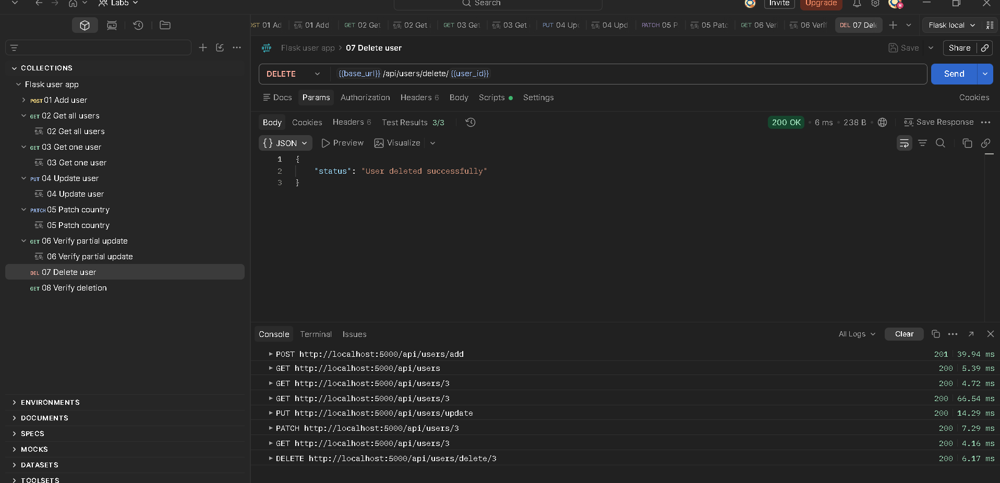
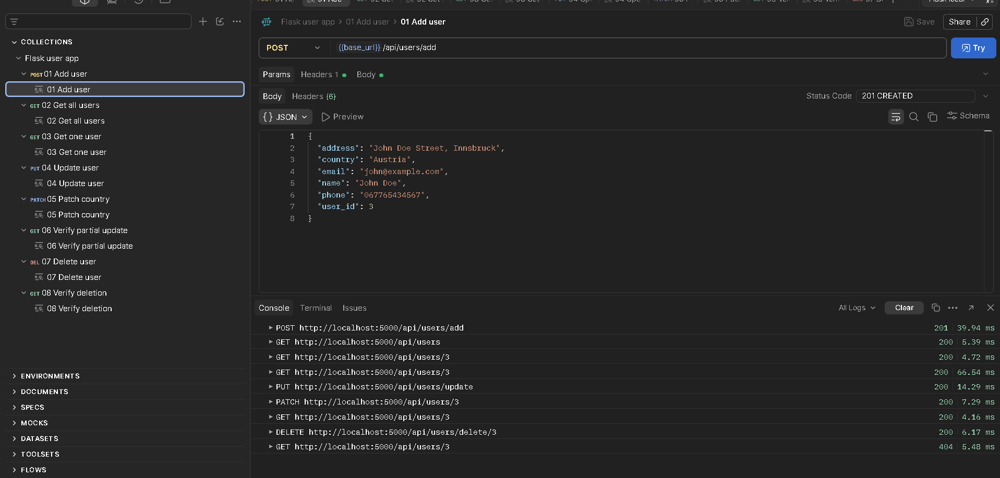

# Lab 5 – Postman and APIs

A Flask app that adds, reads, updates and deletes users in a SQLite database through a REST API, tested with Postman.

## Files

| File | Purpose |
| --- | --- |
| `database.py` | Creates the `users` table and the database functions (insert, get all, get by id, update, patch, delete) |
| `app.py` | Flask REST API that exposes the database functions |
| `database.db` | SQLite database created by running the app |
| `test_app.py` | Unit tests for the API |
| `Flask user app.postman_collection.json` | Postman collection exported from Postman |
| `Flask local.postman_environment.json` | Postman environment holding `base_url` |
| `screenshots/` | Browser and Postman screenshots |

## Run the app

```powershell
py -m venv .venv
.\.venv\Scripts\Activate.ps1
pip install -r requirements.txt
python app.py
```

The API runs on `http://localhost:5000`. SQLite comes with Python, so `db-sqlite3` is not needed.

## API endpoints

| Operation | Method | Endpoint |
| --- | --- | --- |
| Get all users | GET | `/api/users` |
| Get one user | GET | `/api/users/<user_id>` |
| Add user | POST | `/api/users/add` |
| Update user | PUT | `/api/users/update` |
| Update some fields (extra) | PATCH | `/api/users/<user_id>` |
| Delete user | DELETE | `/api/users/delete/<user_id>` |

Example body for POST (PUT uses the same fields plus `user_id`):

```json
{
  "name": "John Doe",
  "email": "john@example.com",
  "phone": "067765434567",
  "address": "John Doe Street, Innsbruck",
  "country": "Austria"
}
```

Changes from the handout code: missing users return 404 instead of `{}`, invalid bodies return 400, a new user returns 201, and the table is created with `IF NOT EXISTS` so the app can be restarted safely.

## Browser test of the GET endpoints





## Postman

1. Collection **Flask user app** with one request per endpoint.
2. Environment **Flask local** with the variable `base_url = http://localhost:5000`; every request uses `{{base_url}}`.
3. The POST request's test script stores the new user's id in the `user_id` collection variable, used by the later requests.
4. Each request has a saved example.

### Collection and environment



### Requests











### Saved example



## Tests

```powershell
python -m unittest -v
```
