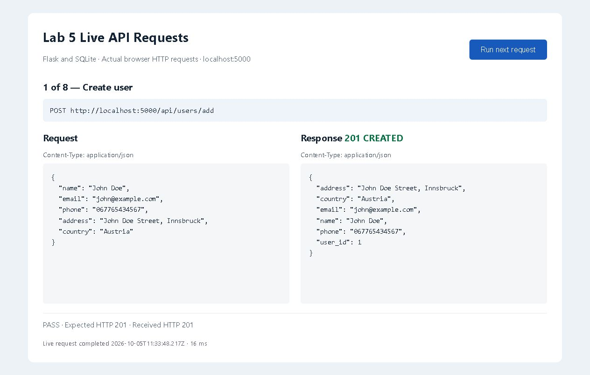
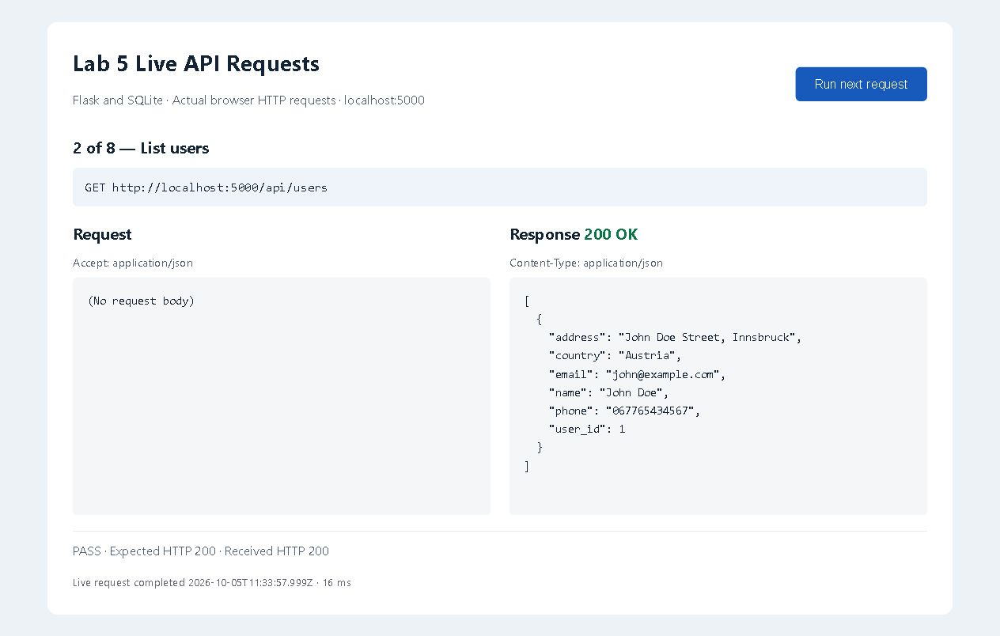
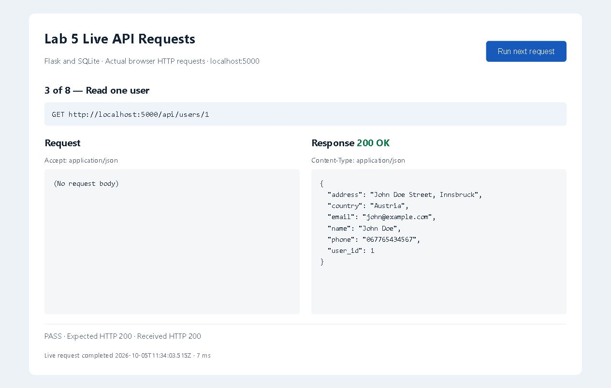
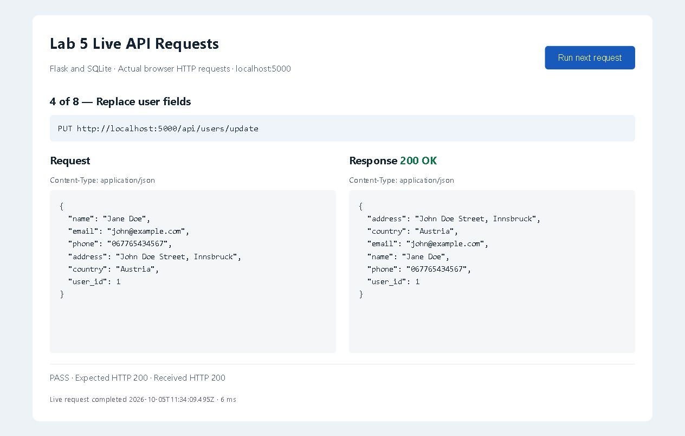
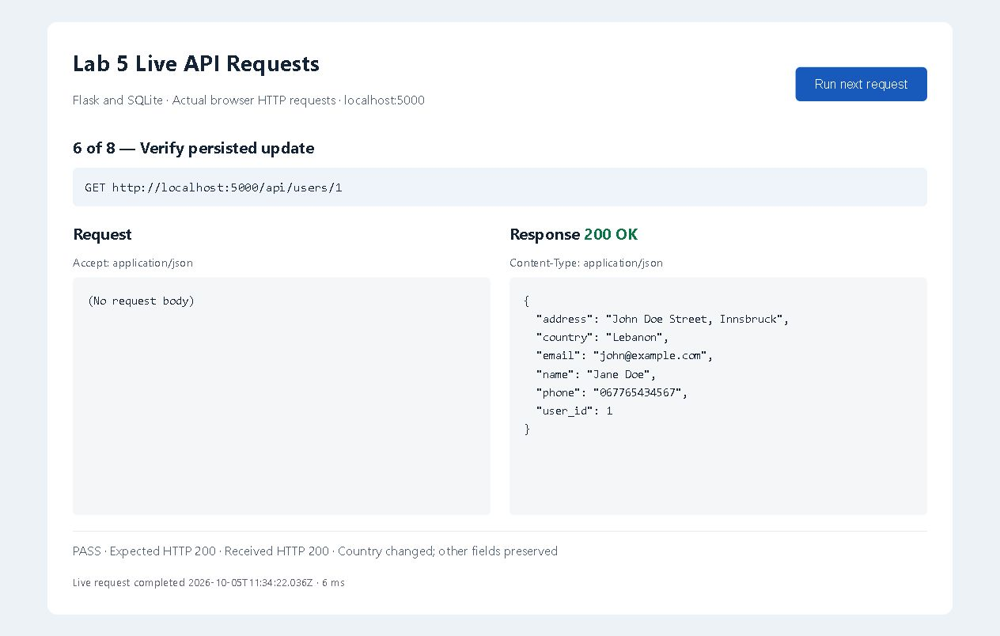
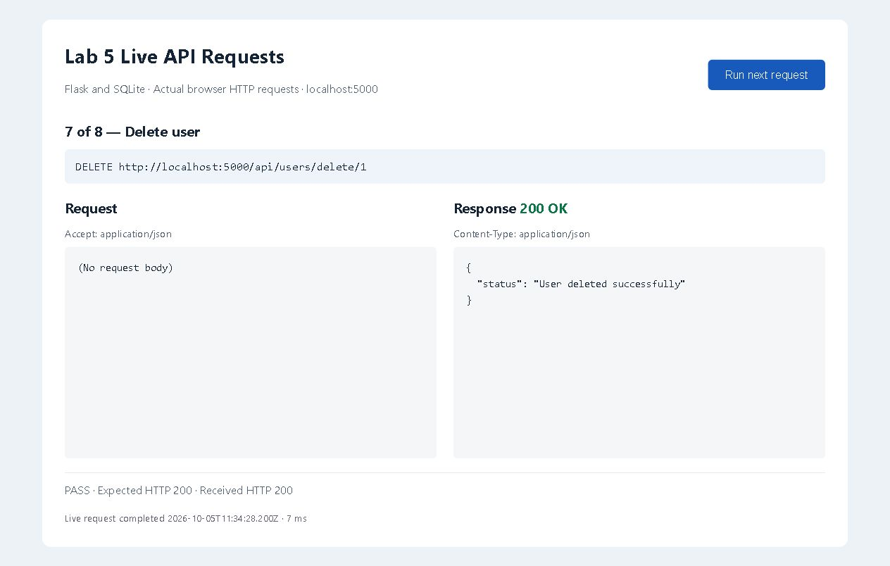
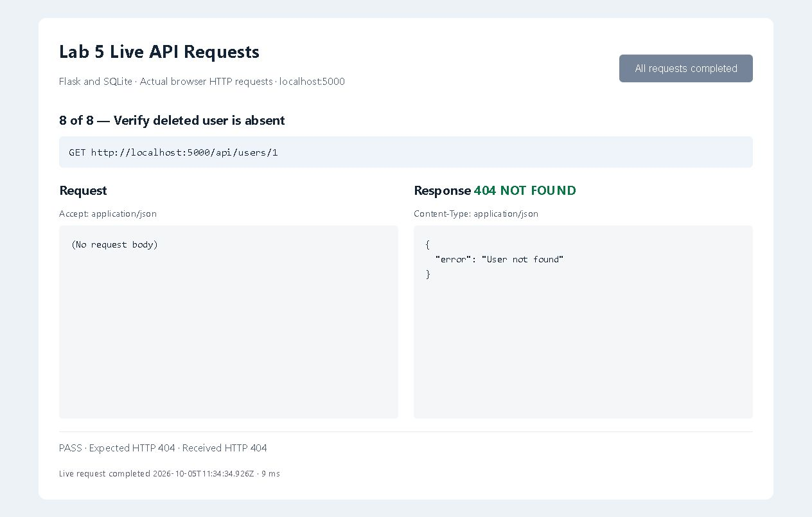

# Lab 5 Postman and APIs

This repository contains `database.py`, `app.py`, `database.db`, eight screenshots of live HTTP requests and responses, and the importable **Flask user app** Postman collection. It supports GET, POST, PUT, PATCH, and DELETE.

## Run the application

Open this folder in VS Code. In a PowerShell terminal, run:

```powershell
py -m venv .venv
.\.venv\Scripts\python.exe -m pip install -r requirements.txt
.\.venv\Scripts\python.exe app.py
```

Python 3.10 or later is recommended. SQLite is part of Python; do not install `db-sqlite3`. The included `database.db` is tracked in Git and contains the users table. Its users are empty after the demonstrated delete operation; generated IDs may start above 1. The app creates the database if it is missing. Keep the terminal running while using Postman. Press Ctrl+C to stop it. This is a local teaching app without authentication; use fictional records.

Open http://127.0.0.1:5000/api/users in a browser to view the user list. Initially it is `[]`. After adding a user, open `/api/users/1` if the returned user ID is 1, or substitute the returned ID.

## Complete the Postman workflow

1. Create a workspace in Postman if you do not already have one.
2. Use Import to import [Flask user app.postman_collection.json](Flask%20user%20app.postman_collection.json).
3. Create and select an environment with the single variable **`base_url` = `http://localhost:5000`**, without a trailing slash. Alternatively, import the included `Flask local.postman_environment.json`.
4. Run all eight requests in numbered order, or send each request in that order. The first request creates a fictional user and stores its ID in the `user_id` **collection variable**. Later requests use that ID; no extra environment variable is needed. Keep every request selected when running the collection.
5. Inspect the response body, status, and test results. Each request already contains a saved example captured from a live local HTTP run. To save your own result, send the request and choose **Save response as example** (the label may vary by version).
6. The final request intentionally returns **404** to confirm deletion; its test should pass. Running the complete collection again creates and deletes a new record.

For the web version of Postman, use the Desktop Agent for the local API, or use the Postman desktop app.

## Required endpoints

| Operation | Method | URL | Success |
| --- | --- | --- | --- |
| List users | GET | `{{base_url}}/api/users` | 200 and an array |
| Read one user | GET | `{{base_url}}/api/users/{{user_id}}` | 200 and a user |
| Create user | POST | `{{base_url}}/api/users/add` | 201 and the created user |
| Update user | PUT | `{{base_url}}/api/users/update` | 200 and the updated user |
| Partially update user | PATCH | `{{base_url}}/api/users/{{user_id}}` | 200 and the updated user |
| Delete user | DELETE | `{{base_url}}/api/users/delete/{{user_id}}` | 200 and a status message |

POST and PUT use **Body → raw → JSON**. Example POST body:

```json
{
  "name": "John Doe",
  "email": "john@example.com",
  "phone": "067765434567",
  "address": "John Doe Street, Innsbruck",
  "country": "Austria"
}
```

PUT includes all five fields plus a numeric `user_id`. The collection provides this automatically. Phone numbers are strings so leading zeroes are preserved. Required text fields must be nonempty strings. Invalid data returns 400; missing or incorrect JSON content type returns 415; nonexistent users return 404.

PATCH accepts any nonempty subset of the five user fields and preserves the others. For example, `{"country": "Lebanon"}` updates only the country. Unknown fields are rejected.

## How the code works

`database.py` opens SQLite connections, creates the users table, and implements the database operations. Parameterized SQL keeps user input separate from SQL syntax. Transactions commit successful changes, roll back failures, and close connections. The database path is relative to the project file, so changing the terminal directory does not create another database accidentally.

`app.py` maps the lab's routes to these functions. It validates request bodies and returns JSON with explicit HTTP status codes. CORS is enabled for the lab's API routes; CORS controls browser access and is not authentication or a firewall.

The supplied handout's broken multiline strings, indentation, `conn().rollback()` typo, and missing connection cleanup have been corrected. Table creation can safely run more than once.

## Validation

Run the automated tests:

```powershell
.\.venv\Scripts\python.exe -m unittest -v
```

Seven automated tests passed: complete CRUD with database persistence, missing users, invalid inputs, SQL-like text stored safely, repeated initialization, partial updates, and invalid PATCH requests leaving records unchanged. Eight live browser HTTP requests also passed, covering create, list, read, update, partial update, read after update, delete, and read after deletion. Automated tests use temporary databases.

The collection was also executed with Newman, Postman's command-line runner, using only `base_url=http://localhost:5000`: **8 requests and 26 assertions passed with zero failures**. Each collection request includes a saved example captured from an actual local HTTP response. The Postman desktop interface was not operated.

## Git and GitHub

The history contains a database commit on `main`, an `api-implementation` branch containing the API and Postman files, its merge into `main`, and a submission update adding PATCH, the tracked database, and screenshots. Inspect it with:

```powershell
git log --oneline --graph --all
```

Clone this submission:

```powershell
git clone https://github.com/NatalioH/lab5-postman-and-apis.git
cd lab5-postman-and-apis
```

The database is deliberately included for grading. Virtual environments, Python caches, and SQLite temporary files are ignored.

## Request and response screenshots

These are actual browser screenshots of a local API test client sending requests to the running Flask app. They show the method, URL, request body, status, and JSON response. They are not Postman screenshots. The equivalent requests and examples are in the importable collection.

### POST creates a user



### GET lists users



### GET retrieves one user



### PUT replaces user fields



### PATCH changes only the country


### GET confirms the changes were saved



### DELETE removes the user



### GET confirms deletion



## References

- Lab handout: `Lab5-Postman and APIs.docx`.
- Postman quick start: https://learning.postman.com/docs/getting-started/quick-start/
- Sending requests: https://learning.postman.com/docs/use/send-requests/requests/
- Flask testing: https://flask.palletsprojects.com/en/stable/testing/
